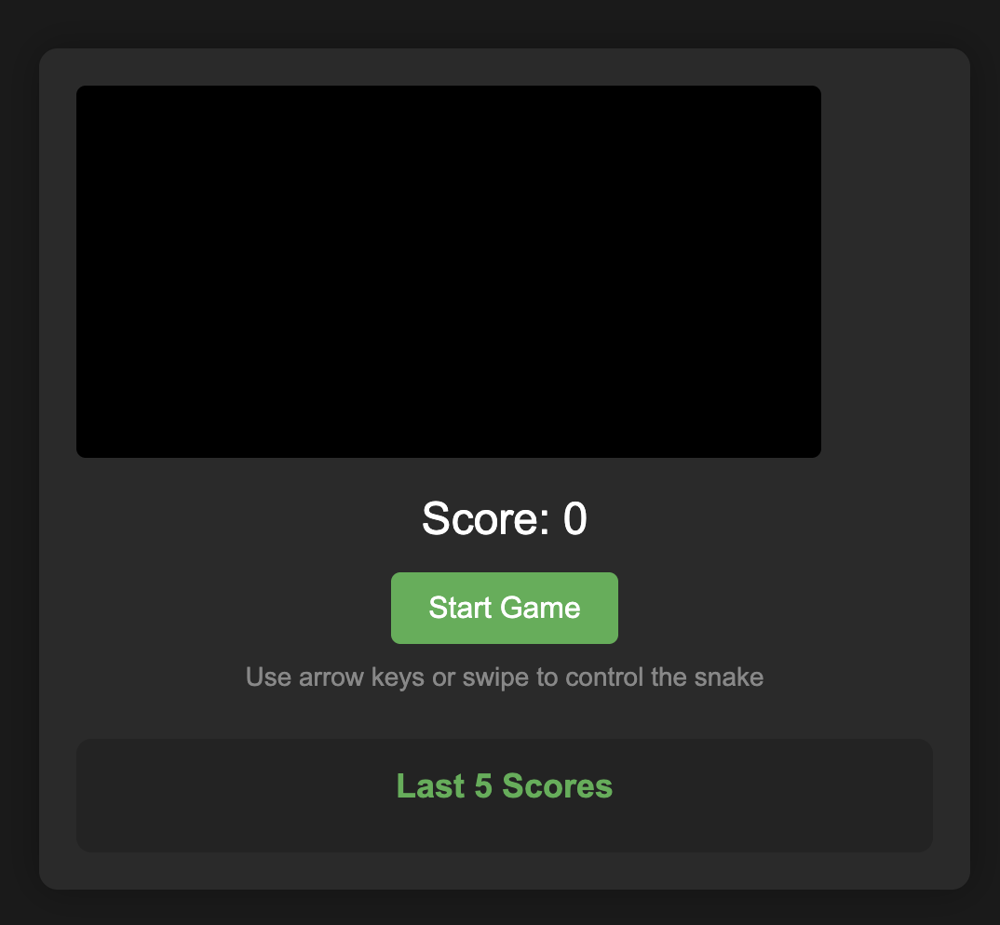

# 🐍 Snake Game PWA

A modern, responsive Snake game built as a Progressive Web App (PWA) that works on both desktop and mobile devices. The game features touch controls, score tracking, and offline functionality.



## ✨ Features

- 🎮 Classic Snake gameplay
- 📱 Mobile-friendly with touch controls
- 💾 Offline support (PWA)
- 📊 Score tracking with local storage
- 🎯 Responsive design
- 🎨 Modern UI with dark theme
- 📱 Installable on mobile devices

## 🚀 Live Demo

[Play the game here](https://somedev.github.io/snake-js)

## 🛠️ Technologies Used

- HTML5 Canvas
- JavaScript (ES6+)
- CSS3
- Progressive Web App (PWA)
- Service Workers
- Local Storage API

## 📦 Installation

1. Clone the repository:
```bash
git clone https://github.com/somedev/snake-game-pwa.git
```

2. Navigate to the project directory:
```bash
cd snake-game-pwa
```

3. Open `index.html` in your browser or serve it using a local server:
```bash
# Using Python
python -m http.server 8000

# Using Node.js
npx serve
```

## 🎮 How to Play

### Desktop Controls
- Use arrow keys to control the snake
- Press the "Start Game" button to begin
- Try to eat the red food to grow and increase your score
- Avoid hitting the walls or the snake's body

### Mobile Controls
- Swipe in the direction you want to move
- Tap the "Start Game" button to begin
- The game automatically adjusts to your screen size

## 📱 PWA Installation

### On Mobile:
1. Open the game in Chrome
2. Tap the menu (three dots)
3. Select "Add to Home Screen"
4. The game will now be available as an app

### On Desktop:
1. Open the game in Chrome
2. Click the install icon in the address bar
3. Click "Install" in the prompt

## 🛠️ Development

### Project Structure
```
snake-game-pwa/
├── index.html          # Main HTML file
├── style.css          # Styles
├── game.js            # Game logic
├── sw.js             # Service Worker
├── manifest.json      # PWA manifest
├── icons/            # App icons
└── README.md         # Documentation
```

### Building and Testing
1. Make sure all files are in the correct directory structure
2. Test the PWA functionality using Chrome DevTools
3. Verify offline functionality
4. Test on different devices and screen sizes

## 🤝 Contributing

Contributions are welcome! Please feel free to submit a Pull Request.

1. Fork the repository
2. Create your feature branch (`git checkout -b feature/AmazingFeature`)
3. Commit your changes (`git commit -m 'Add some AmazingFeature'`)
4. Push to the branch (`git push origin feature/AmazingFeature`)
5. Open a Pull Request

## 📝 License

This project is licensed under the MIT License - see the [LICENSE](LICENSE) file for details.

## 🙏 Acknowledgments

- Inspired by the classic Snake game
- Built with modern web technologies
- Thanks to all contributors and users

## 📧 Contact

Project Link: [https://github.com/somedev/snake-game-pwa](https://github.com/somedev/snake-game-pwa) 